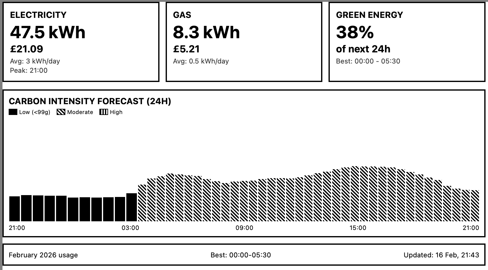

# OctoTRMNL

> Display your Octopus Energy usage, costs, and carbon intensity forecasts on a TRMNL e-ink display

[](https://opensource.org/licenses/MIT)
[](https://workers.cloudflare.com/)
[](https://usetrmnl.com/)

<p align="center">
  
</p>

## ✨ Features

✅ **Monthly Energy Usage** - Track electricity and gas consumption in kWh and £
✅ **Daily Averages** - See your average daily electricity and gas usage
✅ **Peak Usage Time** - Identify when you use the most electricity
✅ **Carbon Intensity Forecast** - 24-hour forecast with visual bar chart
✅ **Green Energy Insights** - % green energy, best time windows to run appliances
✅ **Cost Tracking** - Accurate cost calculation including unit rates and standing charges
✅ **Free Tier Friendly** - Runs entirely on Cloudflare Workers free tier with efficient caching
✅ **Auto-Updates** - Refreshes every 3 hours automatically

## Architecture

```
┌─────────────────┐
│  TRMNL Device   │
│  (800×480 px)   │
└────────┬────────┘
         │ Polls every 30 minutes
         ↓
┌─────────────────┐
│ Cloudflare      │
│ Worker (Free)   │
└────────┬────────┘
         │
         ├─→ Octopus Energy API (consumption, pricing)
         └─→ Carbon Intensity API (forecast)
```

## Prerequisites

### Required Accounts

1. **Octopus Energy Account**
   - Active account with smart meters (electricity and gas)
   - API key (get from: Developer settings in your account)
   - MPAN, MPRN, and meter serial numbers

2. **Cloudflare Account** (free tier)
   - Sign up at: https://dash.cloudflare.com/sign-up

3. **TRMNL Account**
   - TRMNL device or Developer Add-on/BYOD license
   - Get from: https://usetrmnl.com

### Required Software

- **Node.js** (v18 or later): https://nodejs.org/
- **Wrangler CLI**: `npm install -g wrangler`
- **Ruby 3.x** (for TRMNL plugin development): https://www.ruby-lang.org/
- **TRMNLP** (optional, for local testing): `gem install trmnlp`

## Part 1: Cloudflare Worker Setup

### Step 1: Get Your Octopus Energy Details

1. **Get API Key**:
   - Log into your Octopus Energy account
   - Go to Developer Settings or Account Settings
   - Generate/copy your API key

2. **Get Meter Details**:
   You can find these via the API or on your bills:

   ```bash
   # Using the API (replace with your details)
   curl -u "YOUR_API_KEY:" https://api.octopus.energy/v1/accounts/YOUR_ACCOUNT_NUMBER/
   ```

   This returns:
   - **MPAN**: 13-digit electricity meter number
   - **MPRN**: Gas meter reference number
   - **Electricity Serial**: Electricity meter serial number
   - **Gas Serial**: Gas meter serial number

3. **Get Tariff Codes**:
   From the same API response or your bills:
   - Electricity product code (e.g., `AGILE-FLEX-22-11-25`)
   - Electricity tariff code (e.g., `E-1R-AGILE-FLEX-22-11-25-M`)
   - Gas product code (e.g., `VAR-22-11-01`)
   - Gas tariff code (e.g., `G-1R-VAR-22-11-01-M`)

### Step 2: Clone and Configure

```bash
# Clone the repository
git clone https://github.com/YOUR-USERNAME/octotrmnl.git
cd octotrmnl

# Install dependencies
npm install

# Login to Cloudflare
wrangler login

# Create KV namespace for caching (using project-specific name)
wrangler kv namespace create OCTOPUS_CACHE

# Copy the namespace ID from the output and update wrangler.toml
# Replace "YOUR_KV_NAMESPACE_ID" with the actual ID
```

### Step 3: Configure Secrets

```bash
# Add your Octopus Energy API key
wrangler secret put OCTOPUS_API_KEY
# Paste your API key when prompted

# Add meter details
wrangler secret put MPAN
# Enter your electricity MPAN

wrangler secret put MPRN
# Enter your gas MPRN

wrangler secret put ELECTRICITY_SERIAL
# Enter your electricity meter serial number

wrangler secret put GAS_SERIAL
# Enter your gas meter serial number

wrangler secret put ACCOUNT_NUMBER
# Enter your Octopus account number
```

### Step 4: Update Tariff Configuration

Edit `wrangler.toml` and update the tariff codes under `[vars]`:

```toml
[vars]
ELECTRICITY_PRODUCT = "YOUR-ELECTRICITY-PRODUCT"
ELECTRICITY_TARIFF = "YOUR-ELECTRICITY-TARIFF"
GAS_PRODUCT = "YOUR-GAS-PRODUCT"
GAS_TARIFF = "YOUR-GAS-TARIFF"
```

### Step 5: Deploy Worker

```bash
# Deploy to Cloudflare
wrangler deploy

# Test the endpoint
curl https://octotrmnl.YOUR-SUBDOMAIN.workers.dev
```

You should see JSON output with your energy data!

### Step 6: Verify Data

Check the response includes:
- `electricity.kwh` and `electricity.cost_gbp`
- `gas.kwh` and `gas.cost_gbp`
- `carbon_forecast` array with 48 periods
- `carbon_summary` with green percentage and best window

## Part 2: TRMNL Plugin Setup

### Step 1: Local Testing (Optional)

```bash
# Navigate to plugin directory
cd trmnl-plugin

# Install TRMNLP (if not already installed)
gem install trmnlp

# Start local dev server
trmnlp serve
```

Open http://localhost:1234 to preview your plugin with test data.

### Step 2: Create Private Plugin

1. Go to https://trmnl.com/plugins/my/new
2. Click "Create Private Plugin"
3. Fill in:
   - **Name**: Octopus Energy Monitor
   - **Description**: Track energy usage and carbon intensity
   - **Strategy**: Polling
   - **Polling URL**: Your Cloudflare Worker URL
   - **Refresh Interval**: 180 minutes (3 hours)
4. Upload `plugin.liquid` as your template
5. Save the plugin

### Step 3: Configure on Device

1. In your TRMNL dashboard, add the plugin to your device
2. Select viewport: **Full Screen**
3. Set refresh schedule (recommended: every 3-4 hours)
4. Save and trigger a manual refresh

Your TRMNL should now display your Octopus Energy data!

## Understanding the Display

### Top Section (3 Cards)

**⚡ Electricity Card**:
- Total kWh this month
- Total cost (£) including standing charges
- Daily average kWh
- Peak usage time

**🔥 Gas Card**:
- Total kWh this month
- Total cost (£) including standing charges

**🌱 Green Energy Card**:
- % of next 24h with green energy (<99g CO₂/kWh)
- Best continuous time window for running appliances
- Next green period (if currently not green)

### Middle Section (Chart)

24-hour carbon intensity forecast:
- **Solid black bars**: Green/low carbon (<99g CO₂/kWh)
- **Diagonal stripes**: Moderate carbon (99-150g)
- **Horizontal stripes**: High carbon (>150g)

Bar height represents intensity level.

### Bottom Section

- Current month name
- Recommendation for when to run appliances

## Cost Calculation

The worker calculates monthly costs as:

```
Total Cost = (Consumption × Unit Rate) + (Days × Standing Charge)
```

- **Unit Rate**: Average rate for the month (pence/kWh)
  - For fixed tariffs: single rate
  - For Agile: time-weighted average of all rates
- **Standing Charge**: Daily fixed cost (pence/day)
- Both include 5% VAT

## Caching Strategy

To minimize API calls and stay within Cloudflare's free tier:

- **Consumption data**: Cached for 6 hours
- **Pricing data**: Cached for 24 hours
- **Carbon intensity**: Cached for 30 minutes
- **Peak usage time**: Cached for 24 hours

Total API calls per day: ~20-30 (well under Cloudflare's 100,000/day limit)

## Troubleshooting

### Worker Returns Error

1. **Check secrets are configured**:
   ```bash
   wrangler secret list
   ```

   Should show: OCTOPUS_API_KEY, MPAN, MPRN, ELECTRICITY_SERIAL, GAS_SERIAL, ACCOUNT_NUMBER

2. **Check KV namespace**:
   Verify `wrangler.toml` has the correct KV namespace ID

3. **Test API access**:
   ```bash
   curl -u "YOUR_API_KEY:" https://api.octopus.energy/v1/accounts/YOUR_ACCOUNT/
   ```

### No Data Displayed on TRMNL

1. **Check Worker URL**: Verify the polling URL in TRMNL settings
2. **Test Worker directly**: Open Worker URL in browser
3. **Check TRMNL logs**: Look for errors in plugin settings
4. **Verify viewport**: Should be set to "Full Screen"

### Incorrect Costs

1. **Verify tariff codes**: Check `wrangler.toml` has correct product/tariff codes
2. **Check standing charges**: Different regions have different rates
3. **Review calculation**: Check worker logs for rate values

### Missing Peak Time

Peak time requires at least 7 days of half-hourly consumption data. If you just got a smart meter, this may not be available yet.

## Customization

### Change Refresh Interval

Edit `strategy.yml`:
```yaml
interval: 120  # Change to desired minutes
```

### Modify Layout

Edit `trmnl-plugin/plugin.liquid`:
- Adjust card sizes
- Change fonts/styling
- Add/remove data fields
- Customize chart appearance

### Add More Data

Extend `src/index.js` to fetch additional data:
- Half-hourly breakdown
- Historical comparisons
- Export data (if you have solar)
- Multiple properties

## Free Tier Limits

**Cloudflare Workers (Free)**:
- ✅ 100,000 requests/day (you'll use ~20-30)
- ✅ 10ms CPU time (current usage: ~5ms)
- ✅ 100,000 KV reads/day (you'll use ~50-100)

**Octopus Energy API**:
- ~100 requests/minute (dynamic limiting)
- With caching, you'll make 5-7 requests per TRMNL refresh
- At 3-hour intervals: ~40 requests/day

Both well within limits! 🎉

## Support

### Issues with Octopus API
- Octopus Energy API Guide: https://www.guylipman.com/octopus/api_guide.html
- Official docs: https://developer.octopus.energy/

### Issues with Cloudflare Workers
- Cloudflare Workers docs: https://developers.cloudflare.com/workers/
- Wrangler CLI docs: https://developers.cloudflare.com/workers/wrangler/

### Issues with TRMNL
- TRMNL docs: https://docs.trmnl.com/
- TRMNL support: https://help.trmnl.com/

## 🤝 Contributing

Contributions are welcome! Please see [CONTRIBUTING.md](CONTRIBUTING.md) for guidelines.

## 📝 License

This project is licensed under the MIT License - see the [LICENSE](LICENSE) file for details.

## 🙏 Acknowledgments

Data sources:
- [Octopus Energy API](https://developer.octopus.energy/)
- [National Grid Carbon Intensity API](https://carbonintensity.org.uk/)

## ⭐ Show Your Support

If this project helped you display your energy data on TRMNL, please give it a star!
